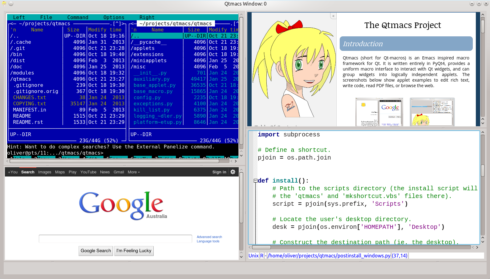

======
QTMACS
======

Qtmacs is an Emacs inspired macro framework for Qt. It consists of
task related applets and widget specific macros.

Applets are basically plain windows that can house arbitrary
code and widgets. Within Qtmacs, they provide the functionailty to
eg. edit text, view a PDF file, or browse the web.

Macros, on the other hand, govern the behaviour of individual widgets
in response to keyboard input. They are are applicable to any Qt based
widget.

Both, applets and macros, are supplied via Python modules and can be
changed during runtime to customise the functionality and behaviour of
Qtmacs as required.

The screenshot below shows applets for Bash (running Midnight
Commander), web browsing, Qtmacs documentation, and source code.

PROJECT STATUS
==============

Qtmacs is currently an alpha version, yet useful enough to demonstrate
the concepts.

REQUIREMENTS
============

* Python >= 3.3
* PyQt >= 4.8

Older versions of PyQt4 may work as well but have not been tested.

INSTALLATION
============

To install Qtmacs on Windows, or use package managers on Linux based
distributions, please refer to the `installation guide
<http://olitheolix.github.com/qtmacs/installation.html>`_.

To try out the source code directly use:

.. code-block:: bash

   git clone https://github.com/olitheolix/qtmacs.git
   cd qtmacs/bin
   ./qtmacs

DOCUMENTATION
=============

The full documentation, including screenshots, is available at
http://olitheolix.github.com/qtmacs/titlepage.html

There is also a discussion group at
https://groups.google.com/forum/?fromgroups#!forum/qtmacs

LICENSE
=======

Qtmacs is licensed under the terms of the GPL.
