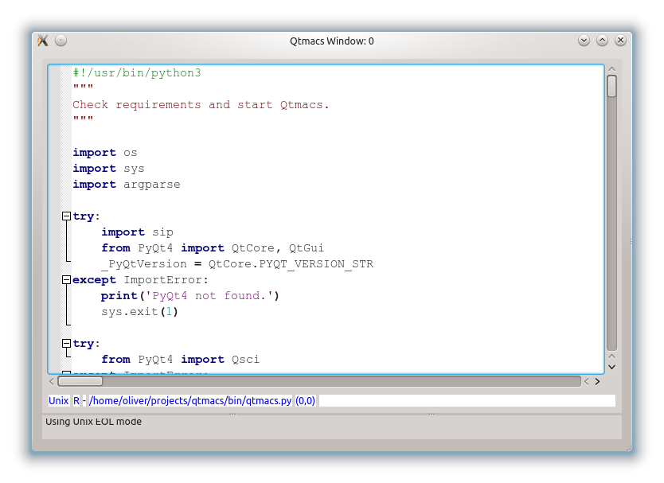
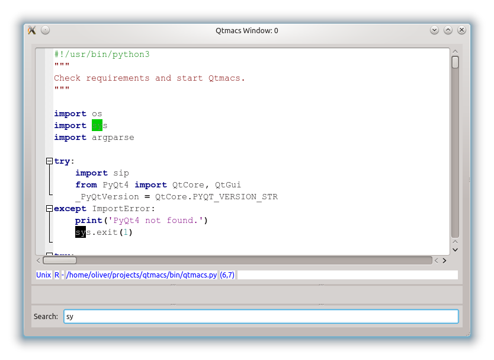
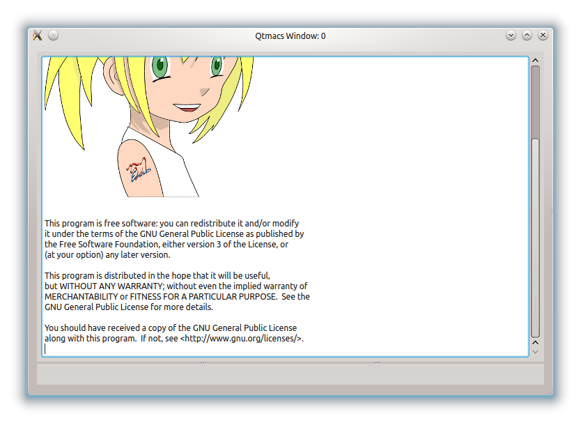
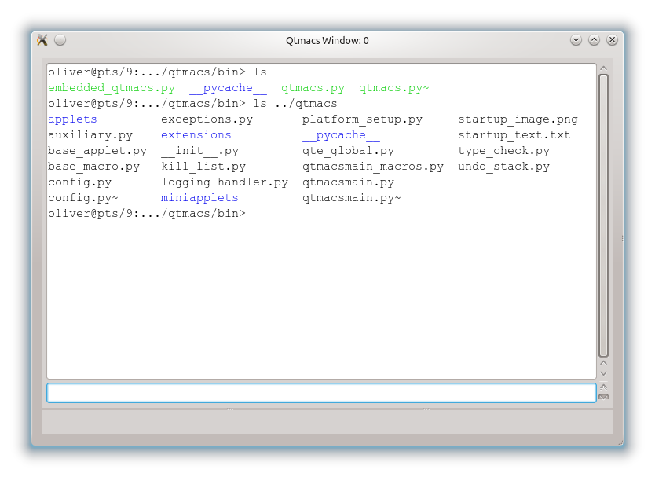
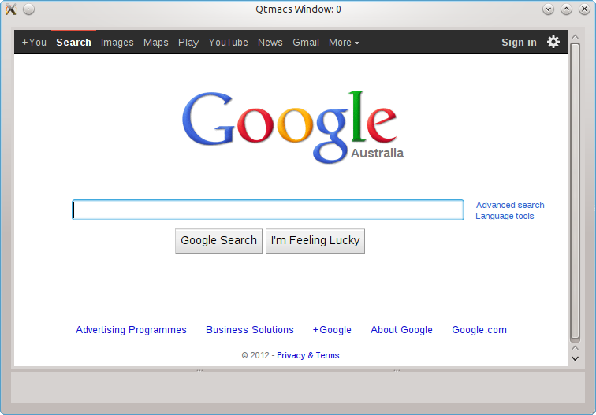
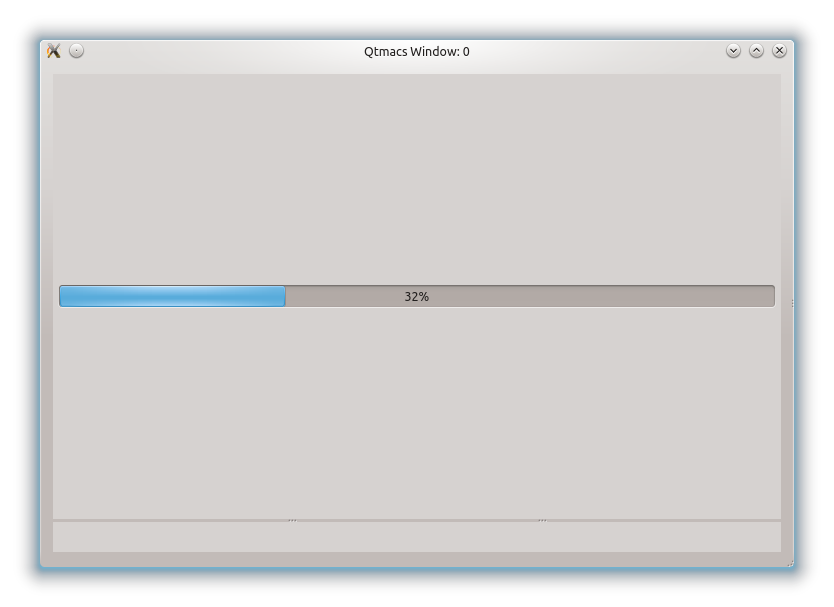
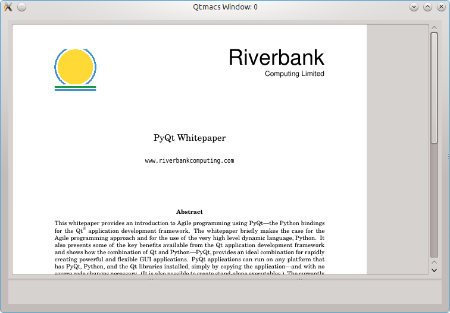

.. _Applets:

=========
 Applets
=========

The entire end-user functionality in Qtmacs is provided through :ref:`applets
<AppletDev>`, and the default ones are listed here.

.. note:: At present, the applets are predominantly proof-of-concepts.

SciEditor
=========

SciEditor is the main applet for editing anything but Rich Text. It is
based on the `Scintilla <http://www.scintilla.org/>`_ widget and
therefore inherits all the features desired and expected from a good
code editor, including folding, syntax highlighting, bracket matching,
line numbering, and much more. The Scintilla widget also makes a good
use case for the modular Qtmacs concept, where the functionality is
provided by an external widget (or a collection thereof grouped together
in an applet), and macros only serve to expose this functionality, not
implement it themselves.

                  

.. centered:: 
   |fig1| |fig2|

The SciEditor applets consists mainly of a :py:mod:`QtmacsScintilla
<qtmacs.extensions.qtmacsscintilla_widget>` widget which is itself
derived from `PyQt4.Qsci.QSciScintilla
<http://www.riverbankcomputing.co.uk/static/Docs/QScintilla2/index.html>`_. The
only fundamental difference to the original `QsciScintilla
<http://www.riverbankcomputing.co.uk/static/Docs/QScintilla2/index.html>`_
widget is the augmented undo-functionality to emulates that of
Emacs. The :py:mod:`current set of macros
<qtmacs.extensions.qtmacsscintilla_macros>` implements the basic
movement macros known from Emacs but not much more at the moment.

The applet still suffers from several unfinished concepts like the mode
bar to display document related information like its name, newline
style, cursor position, and such. Similarly, there are no macros to
format- or spell check text, change the programming language (for syntax
highlighting), interpret the compiler output to highlight errors and
warning, toggle brace matching, and more. Almost all these features are
natively supported by Scintilla but the macros to expose them are not
yet implemented.

The SciEditor may also be useful for Rich Text Editing but this option
has not been fully explored yet.

RichEditor
==========
The RichEditor is similar to the SciEditor but based on the
:py:mod:`QtmacsTextEdit <qtmacs.extensions.qtmacstextedit_widget>`
widget which is itself an augmented version of ``QTextEdit``. The widgets
effortlessly render a subset of HTML and are thus suitable to display
and edit rich text.

Unfortunately, it is tedious to make this class completely undo safe due
to the vast number of text modifying methods spread over several
classes, although most of the basic editing commands are already supported.

LogViewer
=========
All log messages dispatched through the Qtmacs logging system are
automatically displayed in this applet (see :ref:`Logging`). The applet
uses colors to distinguish the different log levels (eg. info, warning,
error), and automatically renders stack traces and error
messages if available. The widget itself is a ``QtmacsTextEditor``
widget endowed with the standard macros, although it is predominantly
for viewing purposes.

.. figure::  images/applet_logviewer.png
   :width: 700px
   :align: center

Bash
====
.. automodule:: qtmacs.applets.bash

Miscellaneous
=============

The applets in this section are available in the `demos` directory.
Their main purpose is to illustrate that applets are more or less normal
PyQt programs which can draw on the entire Qt library to implement
anything from web browsers to multi-threaded programs. To try these
demos start Qtmacs with:

.. code-block:: bash

    ./qtmacs.py --load ../demos/alldemos.py

where the only purpose of the `alldemos.py` script is to register the
demos in the directory. These demos can then be spawned with ``<ctrl>+x
<ctrl>+a`` (hit ``<tab`` afterwards to see a list of all available
applets) from within Qtmacs.

Web Browser
-----------
A simple web browser that points to the Google search engine. It accepts
text as usual although all characters are actually inserted via
macros. Additional macros can move the cursor to the left and right
(``<ctrl>+b`` and ``<ctrl>+f``) or scroll the page up and down
(``<ctrl>+p`` and ``<ctrl>+n``). The goal is to eventually endow the
applet with the standard text editing macros found in the SciEditor
applet (or Emacs), and make it possible to compose emails in web-mail
clients as if they were local text files.

The web browser is highly incomplete (you cannot even change the
address, for example), but may be a useful template for interested
developers (see also the :ref:`tutorial <Webbrowser>` on how it is
implemented).

Multi Threading
---------------

Qtmacs is not multi threaded and probably never will be because Qt
dictates that all GUI related functionality must run in the main
thread. On the other hand, applets are free to outsource all their
non-GUI related processing to threads and communicate with them via Qt
signals. The `demo_thread` applet illustrates this concept with a
progress bar update governed by a blocking sleep call. Since the sleep
call is in another thread, the rest of Qtmacs remains responsive,
eg. switching to the next applet with ``<ctrl>+x <ctrl>+n`` works as
usual. See also the :ref:`threading tutorial <ThreadingDev>` for more
information and possible pitfalls.

PDF Viewer
----------

Rendering PDF documents through `Poppler
<http://poppler.freedesktop.org/>`_ is a treat; installing it together
with the `PyQt <https://code.google.com/p/python-poppler-qt4/>`_
bindings is not (see :ref:`here <CompilePoppler>` for how I did it).

After this hurdle is taken, though, a basic PDF viewer is 
:ref:`easy to implement <PDFViewerDev>`.

