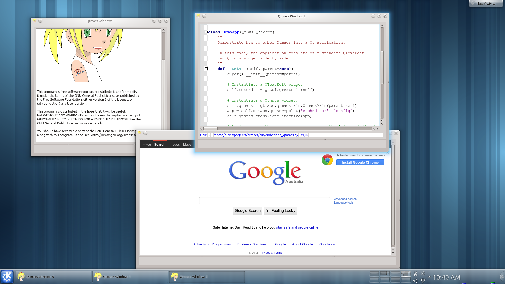
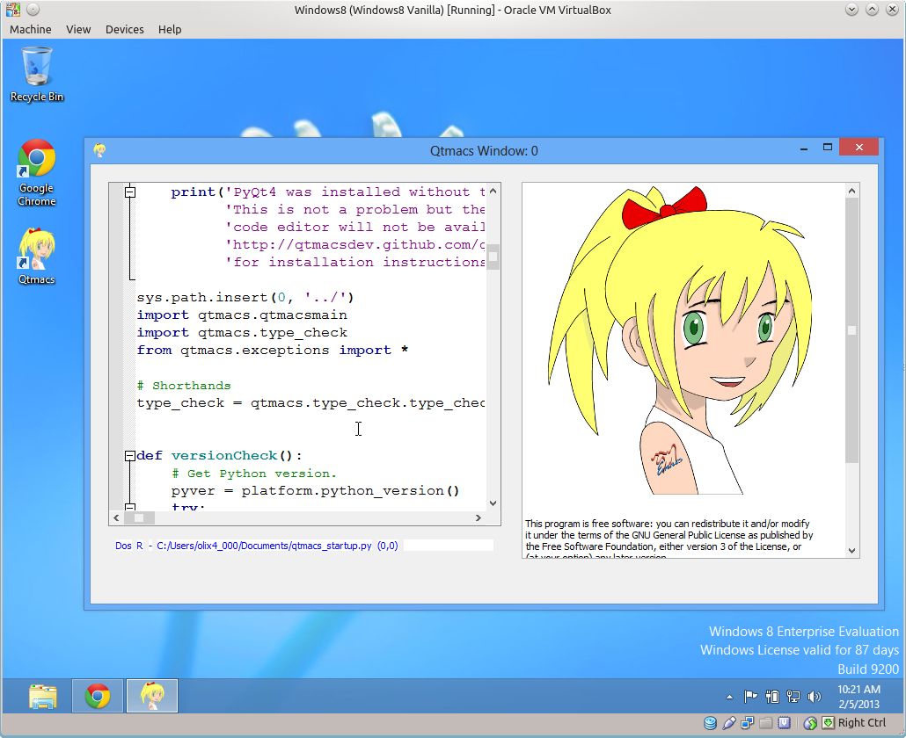
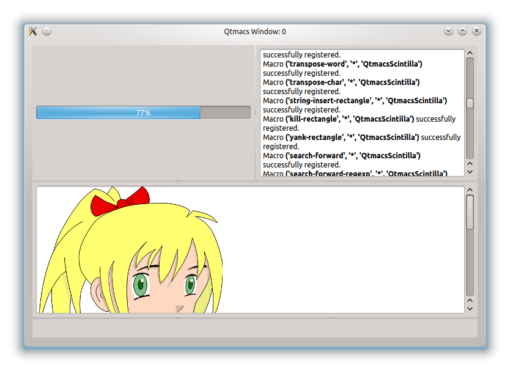
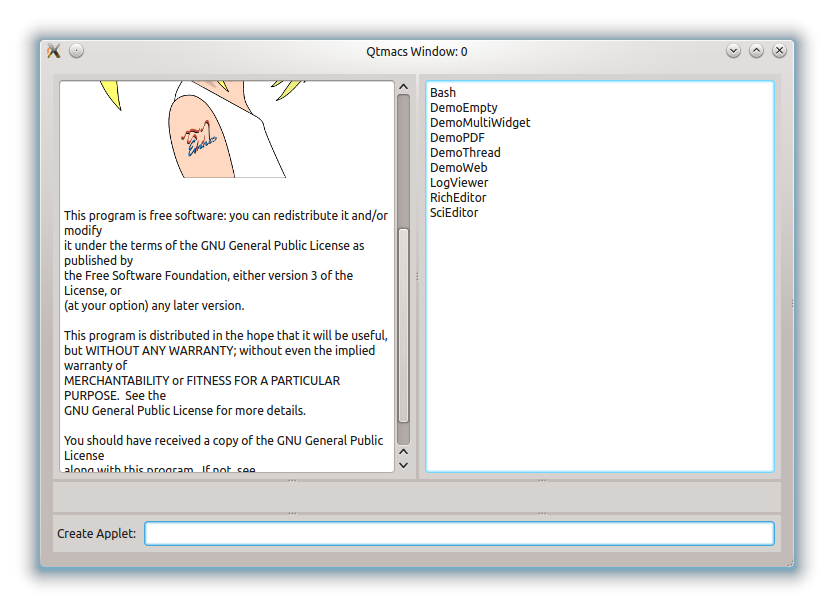

==================
The Qtmacs Project
==================

Introduction
============

Qtmacs (short for Qt-macros) is an Emacs inspired macro framework for
Qt. It is written entirely in PyQt4, provides a uniform macro interface
to interact with Qt widgets, and can group widgets into logically
independent applets. The screenshots below show applet examples to edit
rich text, write code, read PDF files, or browse the web.

.. |logo3| image:: images/split_2.png
   :width: 155px
   :target: _images/split_2.png

.. |logo6| image:: images/scintilla.png
   :width: 155px
   :target: _images/scintilla.png

.. centered::
   |logo3|  |logo4|  |logo5|  |logo6|
   Multiple applets in a single Qtmacs window.

.. centered::
   |logo1|  |logo2|
   Qtmacs on Kubuntu 12.10 (left) and Windows 8 (right).

Applets are dynamically loaded PyQt programs to define and augment the
functionality of Qtmacs. Likewise, macros can also be loaded and altered
at runtime to customise the applet behaviour. Both can draw on the
entire Qt library and third-party PyQt modules to fulfil their
purpose. Together, they can furnish a fully customised work environment.

Installation
============
Qtmacs can be installed from source,  with binary installers on Windows,
and via frontends for the `Python Package Index
<http://pypi.python.org/pypi/qtmacs>`_ (eg. `pip`). In all cases a
working Python3.x and PyQt4-3.x installation is mandatory. See the
:ref:`installation section <Installation>` for more details.

Documentation
=============

This is the Qtmacs documentation. Notable points of interest are
probably the brief :ref:`Qtmacs tour <QtmacsTour>` and the equally brief
:ref:`applet descriptions <Applets>`.

If you are interested in applet- and macro development for Qtmacs
then the :ref:`tutorial <Tutorials>` section and :ref:`API <API>`
documentation will get you started (if not, let me know).

To learn more about the Qtmacs philosophy (and the logo) see the
:ref:`concept <Concept>` section.

License
=======
Qtmacs is licensed under the terms of the GPL.

Development Status
==================
Qtmacs is currently in alpha status but mature enough to demonstrate
the basic concepts.

Project Purpose
===============
A just-for-fun project to see if it can be done.

Contact
=======
If you have any questions, feedback, or would like to help, please
drop me a line at `olitheolix@gmail.com <mailto:olitheolix@gmail.com>`_.

Thank you for visiting my project page.
