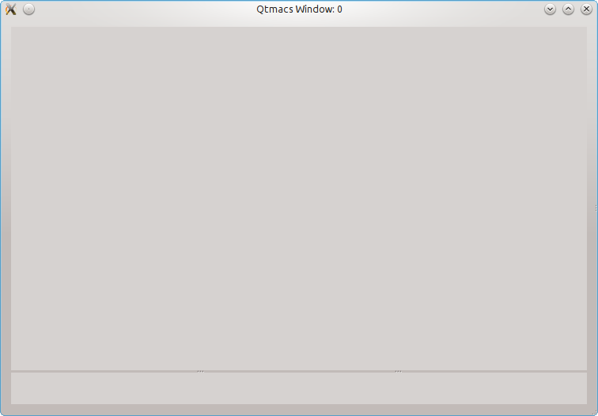
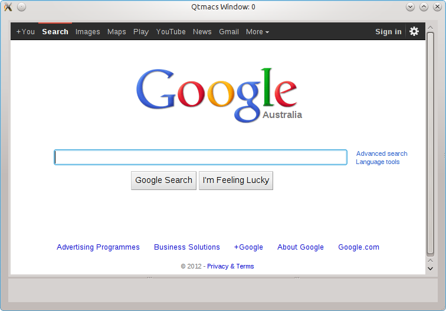

.. |QtmacsTextEdit| replace:: :py:mod:`~qtmacs.extensions.qtmacstextedit_widget.QtmacsTextEdit`
.. |QtmacsMessage| replace:: :py:mod:`~qtmacs.auxiliary.QtmacsMessage`
.. |QtmacsKeysequence| replace:: :py:mod:`~qtmacs.auxiliary.QtmacsKeysequence`
.. |QtmacsMacro| replace:: :py:mod:`~qtmacs.base_macro.QtmacsMacro`
.. |QtmacsApplet| replace:: :py:mod:`~qtmacs.base_applet.QtmacsApplet`
.. |MiniAppletBaseQuery| replace:: :py:mod:`~qtmacs.miniapplets.base_query.MiniAppletBaseQuery`
.. |generateCompletions| replace:: :py:mod:`~qtmacs.miniapplets.base_query.MiniAppletBaseQuery.generateCompletions`
.. |inputCompleted| replace:: :py:mod:`~qtmacs.miniapplets.base_query.MiniAppletBaseQuery.inputCompleted`
.. |MiniAppletFindFile| replace:: :py:mod:`~qtmacs.miniapplets.file_query.MiniAppletFindFile`
.. |toQKeyEventList| replace:: :py:mod:`~qtmacs.auxiliary.QtmacsKeysequence.toQKeyEventList`
.. |qteBindKeyGlobal| replace:: :py:mod:`~qtmacs.qtmacsmain.QtmacsMain.qteBindKeyGlobal`
.. |qteBindKeyApplet| replace:: :py:mod:`~qtmacs.qtmacsmain.QtmacsMain.qteBindKeyApplet`
.. |qteBindKeyWidget| replace:: :py:mod:`~qtmacs.qtmacsmain.QtmacsMain.qteBindKeyWidget`
.. |qteStatus| replace:: :py:mod:`~qtmacs.qtmacsmain.QtmacsMain.qteStatus`
.. |qteAddMiniApplet| replace:: :py:mod:`~qtmacs.qtmacsmain.QtmacsMain.qteAddMiniApplet`
.. |qteRegisterApplet| replace:: :py:mod:`~qtmacs.qtmacsmain.QtmacsMain.qteRegisterApplet`
.. |qteKillMiniApplet| replace:: :py:mod:`~qtmacs.qtmacsmain.QtmacsMain.qteKillMiniApplet`
.. |qteRunHook| replace:: :py:mod:`~qtmacs.qtmacsmain.QtmacsMain.qteRunHook`
.. |qteConnectHook| replace:: :py:mod:`~qtmacs.qtmacsmain.QtmacsMain.qteConnectHook`
.. |qteMakeAppletActive| replace:: :py:mod:`~qtmacs.qtmacsmain.QtmacsMain.qteMakeAppletActive`
.. |qteReplaceWindowInLayout| replace:: :py:mod:`~qtmacs.qtmacsmain.QtmacsMain.qteReplaceWindowInLayout`
.. |qteNewApplet| replace:: :py:mod:`~qtmacs.qtmacsmain.QtmacsMain.qteNewApplet`
.. |qteRegisterMacro| replace:: :py:mod:`~qtmacs.qtmacsmain.QtmacsMain.qteRegisterMacro`
.. |QtmacsMain| replace:: :py:mod:`~qtmacs.qtmacsmain.QtmacsMain`
.. |qteRun| replace:: :py:mod:`~qtmacs.base_macro.QtmacsMacro.qteRun`
.. |qteAddWidget| replace:: :py:mod:`~qtmacs.base_applet.QtmacsApplet.qteAddWidget`
.. |qteSetAppletSignature| replace:: :py:mod:`~qtmacs.base_macro.QtmacsMacro.qteSetAppletSignature`
.. |qteSetWidgetSignature| replace:: :py:mod:`~qtmacs.base_macro.QtmacsMacro.qteSetWidgetSignature`

.. _textCursor.insertText: http://qt-project.org/doc/qt-4.8/qtextcursor.html#insertText
.. _QKeyEvent.text: http://qt-project.org/doc/qt-4.8/qkeyevent.html#text
.. _QTextCursor: http://qt-project.org/doc/qt-4.8/qtextcursor.html
.. _QTextEdit: http://qt-project.org/doc/qt-4.8/QTextEdit.html
.. _QLineEdit: http://qt-project.org/doc/qt-4.8/qlineedit.html
.. _QLabel: http://qt-project.org/doc/qt-4.8/qlabel.html
.. _QScrollArea: http://qt-project.org/doc/qt-4.8/qscrollarea.html
.. _QProgressBar: http://qt-project.org/doc/qt-4.8/qprogressbar.html
.. _QThread: http://qt-project.org/doc/qt-4.8/qthread.html
.. _QPushButton: http://qt-project.org/doc/qt-4.8/qpushbutton.html
.. _animateClick: http://qt-project.org/doc/qt-4.8/qabstractbutton.html#animateClick
.. _QWebView: http://qt-project.org/doc/qt-4.8/qwebview.html
.. _QKeyEvent: http://qt-project.org/doc/qt-4.8/qkeyevent.html
.. _QWidget: http://qt-project.org/doc/qt-4.8/qkeyevent.html

.. |name| replace:: :py:mod:`~qtmacs.qtmacsmain.QtmacsMain.qteNewApplet`

.. _Tutorials:

==================
Programming Qtmacs
==================

A learning-by-doing introduction to programming Qtmacs applets and
macros. This tutorial assumes basic knowledge of Python3 and PyQt4.

Qtmacs consists of applets and macros. The former groups arbitrary
widgets together to solve a particular task (eg. display text, run a
shell, browse a PDF file), and the latter interact with them on
behalf of the user.

Creating Qtmacs applets is hardly different from creating any other PyQt
program: place widgets, connect slots, and implement callback
functions. In Qtmacs, however, the individual widgets can be
(optionally) stripped off their keyboard events. The result is that
their respective ``keypressed`` and ``keyPressedEvent`` methods will not
be called because Qtmacs receives the events instead. To engage with the
widgets again requires to write macros and, optionally, bind them to
shortcuts.

This concept may seem -- in fact is -- impractical for something as
simple as inserting a character into a `QTextEdit`_. However, it is also
the cornerstone that allows to customise the widget interactions freely
without modifying their source code.

Hello World
===========

This quick-start tutorial explains the basic mechanics behind macros and
applets. To write a macro the programmer must subclass |QtmacsMacro|
and reimplement the |qteRun| method, whereas applets must subclass
|QtmacsApplet| and may treat it like a normal `QWidget`_ ie. add widgets
and callback functions. Furthermore, both must be registered with Qtmacs
before they can be used.

.. _Macros:

Macros
------
Create a file called ``tut_1.py`` and populate it with the following
content.

.. literalinclude:: code_snippets/tut_1_1.py
   :language: python
   :linenos:

Line 6 imports the ``qtmacs.qte_global`` module which is the agreed upon
place for global variables. Among other variables, it always contains
``qteMain``, which is a reference to the *one and only* instance of
|QtmacsMain|. This instance is the engine behind all of Qtmacs and
responsible for managing the layout, instantiating applets, spawn
windows, execute macros...

Line 7 imports the base class for all macros (|QtmacsMacro|) and
Line 10 is for convenience only.

The constructor of every macro must list the compatible applet- and
widget signatures (see :ref:`Signatures` for more details), which is
what Lines 24-25 are all about (they effectively ensure that our
"HelloWorld" macro will execute no matter what applet and widget is
currently active).

As mentioned in the introduction already, the macro functionality goes
into the |qteRun| method -- a simple ``print`` statement in our case.

.. note:: the constructor and |qteRun| methods of |QtmacsMacro| are
   the only methods in |QtmacsMacro| that should be overloaded;
   everything else spells trouble unless you know what you are doing.

Line 32 uses |qteRegisterMacro| to register the macro with Qtmacs. The
actual name under which it will be known is either specified explicitly
or, as in our case, implicitly name mangled based on the class name. The
name mangling turns camel bump words into hyphenated lower case words
which means that our ``HelloWorld`` class will become known as the
``hello-world`` macro. To double check, |qteRegisterMacro| will return
the name as well.

.. warning:: |qteRegisterMacro| expects a class, **not** an instance
   of a class. In the above example, the statement::

       macro_name = qteMain.qteRegisterMacro(HelloWorld())

   would raise an error. The correct version is::

       macro_name = qteMain.qteRegisterMacro(HelloWorld)

To try out the macro, invoke Qtmacs from the console with

.. code-block:: bash

   ./qtmacs --load tut_1.py

press ``<alt>+x``, enter ``hello-world`` (you may use ``<tab>``
completion) and see the `Hello world` string appear in the console
window.

The remainder of this section will add two more features, namely 
display the ``hello-world`` message in the status bar and associate
a keyboard shortcut with it. These two modifications are reflected
in the code below:

.. literalinclude:: code_snippets/tut_1_2.py
   :language: python
   :emphasize-lines: 28, 33
   :linenos:

The only two modifications are Line 28, which uses the |qteStatus|
method of the Qtmacs engine, and Line 33, which calls
|qteBindKeyGlobal| to assign the macro a keyboard
shortcut.

The format of key-sequences supplied to |qteBindKeyGlobal| should be
self explanatory: each sequence consists of an optional modifier
(``<alt>+`` or ``<ctrl>+``) in conjunction with a character. Arbitrarily
many of these combinations can be chained together but must be separated
by white-space. To bind the white-space character itself use
``<space>``. Here are some example arguments for |qteBindKeyGlobal|::

    'f'
    'F'
    '<ctrl>+f'
    '<ctrl>+f h <alt>+K <ctrl>+k'
    '<ctrl>++ <ctrl>+<alt>++ <ctrl>+<alt>+<space>'
    '<ctrl>+f <ctrl>+F <ctrl>++ <ctrl>+<space> <ctrl>+< <alt>+> < > <space>'

.. note:: Every macro has the ``self.qteMain`` attribute for convenience,
	  and it is always identical to ``qtmacs.qte_global.qteMain``.

Restarting Qtmacs once more with

.. code-block:: bash

   ./qtmacs --load tut_1.py

allows us to conveniently invoke the ``hello-world`` with the
keyboard shortcut ``<ctrl>+d h``, although the manual way via
``<alt>+x`` will still work. Furthermore, the `Hello world` message will
now appear in the status bar at the bottom of the screen:

   
   A "Hello world" message in the status bar.

.. _AppletDev:

Applets
-------

Applets must inherit from |QtmacsApplet| and may contain arbitrary Qt
widgets as it is itself derived from `QWidget`_. To program an
empty applet put the following code into a file and start Qtmacs as in
the previous section:

.. literalinclude:: code_snippets/tut_1_3.py
   :language: python
   :emphasize-lines: 7, 13-17, 21
   :linenos:

Line 7 imports the |QtmacsApplet| class, Lines 13-17 define the empty
applet, and Line 21 uses |qteRegisterApplet| to make it known to Qtmacs.

Internally, Qtmacs will identify applets via their class names, which
means that our applet will be called ``HelloWorldApplet`` (no name
mangling occurs like for macros).

To instantiate this applet run the command `new-applet`, either by
pressing ``<alt>+x`` to open the macro query, typing ``new-applet``, and
then entering ``HelloWorldApplet``, or skipping the first part by typing
``<ctrl>+x <ctrl>+a`` and then typing the applet name. Either way, you
should be presented with an empty applet like this:

   An empty applet.

The next step is to populate the applet with Qt widgets, for instance a
`QLabel`_ to display the `Hello world` message. This only requires
a constructor to instantiate and place the widget, just like in any
other PyQt program:

.. literalinclude:: code_snippets/tut_1_4.py
   :language: python
   :emphasize-lines: 18-23
   :linenos:

This will change the appearance of the applet to:

   An applet with a QLabel spelling "Hello world".

Other widgets, including layouts, can be added likewise:

.. literalinclude:: code_snippets/tut_1_5.py
   :language: python
   :emphasize-lines: 49-63, 68-69
   :linenos:

Aside from the additional widget, only the Lines 68-69
are new. Their purpose is to instantiate and activate the applet
immediately so that it becomes visible at startup immediately.

   An applet can contain arbitrary widgets from the Qt library.

The |QtmacsApplet| can now be augmented with other widgets and
callback routines to make them useful.

This completes the Hello World tutorial. It showed how to write applet-
and macros but did not elaborate on how to connect macros with
widgets. Currently, all widgets (eg. the `QLineEdit`_) react to
keyboard input as usual although, behind the scenes, Qtmacs intercepts
and parses all their input for macro shortcuts before propagating the
key to the widget.

The :ref:`next section <SimpleEditor>` will explain how to turn off the
native behaviour of the widget so that it can be arbitrarily programmed
with macros.

Remarks
+++++++

|QtmacsApplet| inherits from `QWidget`_ and may therefore contain any
number of Qt widgets and layouts. However, as mentioned above, all keys
are parsed by Qtmacs first and will only passed on to the respective
widget if no macro was associated with that key. For instance, if a
global macro were bound to the ``h`` key then it would not be possible
anymore to enter the character ``h`` into a `QTextEdit`_ or
`QLineEdit`_.

Another noteworthy point is that the ``show()`` and ``hide()`` methods
of applets are inactive. To implement these effects the programmer
must resort to |qteMakeAppletActive| or |qteReplaceWindowInLayout|
since eg. showing an applet implies that another applet must be hidden
or the layout be split. In either case, Qtmacs needs to do some
housekeeping which is encapsulated in the aforementioned methods
|qteMakeAppletActive| and |qteReplaceWindowInLayout|.

.. note:: The ``show()`` and ``hide()`` methods of widgets *inside*
          applets can be used as usual. Just the ``show()`` and
          ``hide()`` method of the applet itself (ie. instances of
          |QtmacsApplet|) can not.

.. _SimpleEditor:

A Text Editor -- Qtmacs Style
=============================

This tutorial will implement a macro driven text editor based on a
`QTextEdit`_. The applet code is not principally different from that of
the previous section except that the widget will be stripped off its
keyboard events with the help of |qteAddWidget|. From then on, the
only way to insert- and delete characters from or move the cursor, is via
macros that program the widget directly.

The goal in this tutorial is not to create a full fledged editor but to
show the principle. To start, create a new file `tut_2.py` and populate
it with the following applet code:

.. literalinclude:: code_snippets/tut_2_1.py
   :language: python
   :linenos:

Note how this code is almost identical to `tut_1.py` from the previous
tutorial except that the `QLabel`_ was replaced by a `QTextEdit`_ and
that |qteAddWidget| is called on it. The ``autoBind=False`` option is
merely to prevent Qtmacs from automatically installing standard macros
which would forfeit the purpose of this tutorial, but is very convenient
otherwise to avoid macro duplication.

.. note:: the widgets for which default key bindings are installed are
	  specified in ``qte_global.default_widget_keybindings``.

After invoking Qtmacs from the shell like so

.. code-block:: bash

   ./qtmacs --load tut_2.py

the following screen will (hopefully) appear:

   An applet with a `QTextEdit`_ component.

If you try to type any text you will notice that the `QTextEdit`_ is
unresponsive. The reason is that |qteAddWidget| told Qtmacs not to
deliver any keyboard events to the widget anymore. Qtmacs will
nonetheless parse all incoming keys for macro shortcuts, but since none
have been defined yet, no macros are executed. This can also be seen in
the LogViewer applet (press ``<ctrl>+n`` until you see it).

   The LogViewer applet reports unknown key-sequences.

The only way to interact with the `QTextEdit`_, and any other widget in
Qtmacs registered via |qteAddWidget|, is via macros -- the core
philosophy of Qtmacs. So, let us write one.

.. note:: Only keyboard events are blocked. Mouse events are delivered
          as usual.

The first macro will allow us to type the character ``e``. The excellent
Qt documentation for `QTextEdit`_ reveals that
`textCursor().insertText('e') <textCursor.insertText>`_ will do the
trick, and the macro to inserts the character ``e`` may therefore look
like this:

.. literalinclude:: code_snippets/tut_2_2.py
   :language: python
   :emphasize-lines: 34-57
   :linenos:

The only notable difference to the boiler plate code from the Macros_
section is Line 52 which uses the ``qteWidget`` attribute to access the
`QTextEdit`_. This attribute is available to all macros and always
points to the widget that was active when the macro was triggered.
Of course, the active widget could be anything and our code should
therefore check that ``qteWidget`` actually *is* a
`QTextEdit`_. However, there are smarter ways to ensure that the macro
is only called for `QTextEdit`_ widgets (see :ref:`Signatures`).

In this example we therefore keep assuming that ``qteWidget`` always does
point to a `QTextEdit`_, which is reasonable because it is the only
widget in the applet. If we now press ``e`` the corresponding letter
will appear because Line 57 bound that key to our macro.

.. _lastKeySequence:

In principle we could now write a macro for every letter but that would
be tedious. A more efficient way is to use the same macro for every
printable key, if only the macro knew which key was pressed. Fortunately,
this information is always available in the global variable
``last_key_sequence`` which references a |QtmacsKeysequence|
instance. This class represents all key sequences inside Qtmacs and
facilitates certain operations and conversions on it. The
conversion of interest to us here is |toQKeyEventList|
because it returns the key sequence as a list of `QKeyEvent`_
objects. These objects, in turn, have a `text() <QKeyEvent.text>`_ method (see Qt
documentation for details) to retrieve the character (if it is
printable).

We may therefore improve upon the previous code as follows:

.. literalinclude:: code_snippets/tut_2_3.py
   :language: python
   :emphasize-lines: 52-65
   :linenos:

This macro is already more flexible but still only works for the ``e``-key
because it has not yet been bound to other keys. The following code
addresses this shortcoming and also renames the macro name to the more
generic ``InsertCharacter``:

.. literalinclude:: code_snippets/tut_2_4.py
   :language: python
   :emphasize-lines: 72-73
   :linenos:

The widget can now displays all the basic alphanumerical characters
except white space. Unlike the other characters, this one cannot be
specified as ``" "`` because white spaces are used to separate keys in
key sequences. If we try nevertheless, then Qtmacs will raise the
following error:

   The log viewer reports an error because the argument to
   |qteBindKeyGlobal| was invalid.

To bind non-standard keys it is necessary to enclose them in angular
brackets, eg. ``<space>``, ``<enter>``, ``<tab>``, ``<F1>``.
However, since our ``InsertCharacter`` macro relies on the `text()
<QKeyEvent.text>`_ method of `QKeyEvent`_ it will still do nothing for
unprintable keys like ``<F1>``.

.. literalinclude:: code_snippets/tut_2_5.py
   :language: python
   :emphasize-lines: 76-77
   :linenos:

People unfamiliar with Emacs (who will probably not read this tutorial
anyway) may object that it is redundant to use macros for inserting
characters into a `QTextEdit`_ because that widget is perfectly capable
of doing so itself. However, since now every action is governed by
macros this also implies that any action can easily be altered with
a new macro; no change in the source code of the widget or Qtmacs is
necessary for that. For instance, a ``<tab>`` may do nothing, or insert
white-space, or open a new applet, or play music, or do all of it, or
nothing. Furthermore, this behaviour can be customised to every applet,
and even every widget inside an applet (see :ref:`Signatures` for more
details). For instance, a ``<tab>`` in one `QTextEdit`_ may open a new
applet to show possible completions, whereas in another `QTextEdit`_ it
may insert white-space, and in a `QWebView`_ it may open the browser
history.

Now that the widget reacts to (most) keys in the expected way we want to
endow it with navigation macros. The principle is the same as before:

* write a macro that uses Qt-native methods of the `QTextEdit`_ to move
  the cursor,
* register it with Qtmacs,
* bind it to a key (optional).

Here is an example for how to delete a character and move the caret to
the left (refer to `QTextCursor`_ for details on how the code works):

.. literalinclude:: code_snippets/tut_2_6.py
   :language: python
   :emphasize-lines: 80-124
   :linenos:

We could now proceed to write all the other navigation- and text editing
macros but this would be cumbersome. For standard widgets like a
`QTextEdit`_ this has been done already and Qtmacs can apply them
automatically. To do so, set the ``autoBind`` flag in Line 25 to
**True**, or drop the parameter altogether (**True** is its default). We
may then also remove our custom macros and bindings:

.. literalinclude:: code_snippets/tut_2_7.py
   :language: python
   :emphasize-lines: 25
   :linenos:

That easy, just like a normal PyQt program but with all the flexibility
of the macro framework. The last modification should be to replace the
`QTextEdit`_ with the drop-in replacement |QtmacsTextEdit|. This widget
was adapted for Qtmacs to emulate the undo behaviour of Emacs, but is
otherwise the same.

To find out which other widgets have default bindings check out the
``default_widget_keybindings`` dictionary in the `qtmacs/qte_global.py`
file. It states, for instance, that the macros for `QTextEdit`_ are
defined in `qtmacs/extensions/qtmacstextedit_macros.py`.

.. _Logging:

Logging
=======

Qtmacs` logging facilities leverage the `logging module
<http://docs.python.org/3.2/library/logging.html?highlight=logging#logging>`_
module from the standard Python library. Upon startup Qtmacs will spawn
a LogViewer applet which automatically connects to it and displays all
log messages henceforth.

To log such a message, use the ``qteLogger`` attribute which is
automatically available to every macro and applet. The usage is
explained in detail in the `logging module`_ documentation, but here are
the typical use cases::

    self.qteLogger.debug('Debug message')
    self.qteLogger.info('Info message')
    self.qteLogger.warning('Warning message')
    self.qteLogger.error('Error message')
    self.qteLogger.critical('Critical message')

All of these can also be called with the ``stack_info=True`` to log a
the current stack trace as well. The LogViewer applet is smart enough to
identify these traces and displays them accordingly.

To try out the logging features, create a file `logdemo.py` with the
following content::

    # Get a handle to the main instance of Qtmacs.
    import qtmacs.qte_global as qte_global
    qteMain = qte_global.qteMain
    
    # Log messages without a stack trace.
    qteMain.qteLogger.debug('Debug message.')
    qteMain.qteLogger.info('Info message.')
    qteMain.qteLogger.warning('Warning message.')
    qteMain.qteLogger.error('Error message.')
    qteMain.qteLogger.critical('Critical message.')
    
    # A log message with a stack trace.
    qteMain.qteLogger.warning('Warning message with stack trace.', stack_info=True)
    
    # Deliberately cause an exception to demonstrate the use of
    # qteLogger.exception() as well. 
    try:
        1/0
    except ZeroDivisionError:
        qteMain.qteLogger.exception('An exception occurred.',
                                 exc_info=True, stack_info=True)
    
Then start Qtmacs with 

.. code-block:: bash

   ./qtmacs --load logdemo.py

to generate the following output in the LogViewer:

.. figure::  images/logdemo.png
   :width: 700px
   :align: center

   The logging messages created by `logdemo.py`.

Additional Examples
===================

The following applets do not introduce any new Qtmacs concepts
but help to illustrate the liberal interplay with the Qt library.

.. _Webbrowser:

Web Browser
-----------

A web browser is easy to implement with Qt because the `QWebView`_
widget already does all the work. Integrating this widget into a Qtmacs
applet is also straightforward, and with the right set of macros it
would be even possible to combine the convenience of web-mail services
with an Emacs like editor experience -- all without any support from the
web page or an external browser.

The `QWebView`_ class is rich in methods but (necessarily) HTML
oriented. The interaction with the widget (eg. moving the cursor,
determining its position, inserting characters, cycling through editable
web elements, ...) therefore requires either pre-defined methods to
support this, or custom JavaScript code.

The applet developed here may not be particularly impressive due to my
lack of JavaScript knowledge yet is still good enough to demonstrate the
seamless integration with Qtmacs and its macros.

In the first step we create an applet with a `QWebView`_ and point it
to Google.

.. literalinclude:: code_snippets/tut_7_1.py
   :language: python
   :linenos:

   A `QWebView`_ in action.

Then we add two macros to scroll the page up and down and bind them to
``<ctrl>+p`` and ``<ctrl>+n``, respectively. To implement this the
macros will first determine the size of the visible area (via
`page().viewportSize
<http://qt-project.org/doc/qt-4.8/qwebpage.html#viewportSize-prop>`_),
compute 25% of that, and call `mainFrame().scroll
<http://qt-project.org/doc/qt-4.8/qwebframe.html#scroll>`_ to scroll the
page.

.. literalinclude:: code_snippets/tut_7_2.py
   :language: python
   :linenos:
   :emphasize-lines: 23-63

To try out the macros it may be necessary to shrink the window until
vertical scroll bars appear. 

So far it is still impossible to enter any text. To remedy this we pass
on all alphanumerical keys to the native ``keyPressEvent`` method which
takes care of the details.

.. literalinclude:: code_snippets/tut_7_3.py
   :language: python
   :linenos:
   :emphasize-lines: 29-39, 78-89

   A sample query.

The last addition in this tutorial are two macros to move the caret
forwards and backwards. The `QWebView`_ already provides pre-defined
`actions` to furnish the necessary functionality:

.. literalinclude:: code_snippets/tut_7_4.py
   :language: python
   :linenos:
   :emphasize-lines: 41-45, 98-121

The applet has now a basic set of features and the keyboard shortcuts
for page scrolling and cursor movements are consistent with those in the
text applet. However, the example relies on explicit `QWebView`_
methods to implement these features (eg. ``keyPressEvent`` method or
web-actions). This suffices for the purposes of this demo but more
sophisticated operations like copying- or inserting characters at a
particular position are not possible with them. To implement them anyway
some JavaScript code is likely going to be mandatory. Any help
with this is welcome, as well as are extensions to the applet itself
(ie. the ability to visit other websites than Google would already make
it remotely useful).

.. _ThreadingDev:

Threading
---------
Qtmacs itself is not, and presumablynever will be, a multi threaded
application. The simple reason is that Qt requires all GUI elements
(ie. everything from ``QtGui.*``) to run in the same thread, which
necessarily includes the Qtmacs windows and applets.

However, non-GUI related code is not affected by this restriction.
Computationally intense routines can therefore be moved into a separate
thread and use Qt signals to report results back to the applet which
can then update its widgets accordingly.

This tutorial shows a simple threading example with two classes: a
``Worker`` with a ``work`` method that uses blocking sleep calls to
periodically trigger a signal, and an applet that updates a progress bar
every time the signal is emitted. Here is the code without threads:

.. literalinclude:: code_snippets/tut_4_1.py
   :language: python
   :linenos:

The ``DemoThread`` applet first instantiates a `QProgressBar`_ and
``Worker`` object. Then it connects the ``sigUpdate`` signal from the
``worker`` to the ``setValue`` slot of `QProgressBar`_. Finally, it
triggers the work in the ``worker`` object with the ``sigStartWork``
signal.

While the whole setup with all the signals is somewhat redundant for a
single threaded setup it will require only a negligible modification to
turn it into a multi threaded version. Beforehand, though,
we want to try out this version.

The result: for the first 3 seconds Qtmacs will be frozen because of
the blocking sleep calls. Afterwards it will come back to life with a
full progress bar -- expected, but unsatisfactory.

.. note:: The ``Worker`` object must be based on ``QtCore.QObject``, or
          any other non-GUI class from the Qt library that inherits it, as
          otherwise the signal-slot mechanism will not work.

The next version will be better because it moves the worker object into
a separate thread:

.. literalinclude:: code_snippets/tut_4_2.py
   :language: python
   :emphasize-lines: 32, 49, 56-60
   :linenos:

Line 32 increase the time spent in the method (to better experiment
with it) and Line 58 updates the maximum value of the progress bar
accordingly. The only new additions are Lines 56-60 which
instantiate a `QThread`_ and push the worker into it.

This time, the progress bar updates continually and Qtmacs remains
responsive as well, which implies that applet switching and
macro execution work as usual while the progress bar updates. The
screenshot below shows the effect of splitting the applet with the
progress bar during its execution.

Threading Pitfalls
++++++++++++++++++

.. warning:: One notable disadvantage of threads is their potential to cause a
             segfault when the applet is killed. If that happens then Qtmacs,
             together with all its applets, are terminated immediately and
             irrevocably by the OS.

There are two typical reasons for when the segfault occurs, and neither
is Qtmacs specific:

1. the worker calls a method of the killed applet,
2. the worker uses a signal defined in the killed applet.

In both cases a dangling pointer is accessed and neither PyQt, nor Qt,
nor Python can safe the program from being terminated by the OS anymore
at that point.

The remedy to case 1) is simple: improve your code; objects in different
threads have no business calling each others' methods directly. The same
functionality can always be reproduced with Qt signals, which are thread
safe by design.

The remedy to option 2) is to *never* use any variables in the worker
class that were not defined in that very class. This includes static
signal definitions.

The reason is that the applet may die (because Qtmacs kills it), but the
worker thread may not. This is perfectly safe unless the worker decides to
directly access variables from the non-existing applet, eg. a signal
that was defined there. For this reason all signals in the
above example were *defined in the worker*, and neither the worker nor
the applet called any of the others' methods directly. The only
exception is Line 54 to connect the signal, but at that point it is
guaranteed that both objects exist and still live in the same thread.

Two questions that may arise in this context:
 
1. Why does Qtmacs not kill the thread when it kills the applet?
2. Why is it safe to kill the applet when signals are still connected to
   another thread?

The answer to the first question is simply that Qtmacs does not know
about the thread (or the worker). Nevertheless, before Qtmacs kills an
applet it calls the ``qteToBeKilled`` method of that applet. Ideally,
this method terminates any running threads spawned by that applet.

The answer to the second question is that PyQt and Qt automatically
disconnect all signals from the object before deleting it. As a result,
the thread may safely continue to emit signals, although no one may be
listening anymore.

The bottom line here is that threaded applets are a good idea as long as
no direct method calls are used, all signals are defined in the
worker, and Qt threads are used instead of Python's threading
module. Explicitly testing what happens when the applet is killed is
usually a good idea as well.

.. _PDFViewerDev:

PDF Viewer
----------

This section implements a PDF viewer based on the `Poppler
<http://poppler.freedesktop.org/>`_ library which also has
a `Qt4 interface <http://people.freedesktop.org/~aacid/docs/qt4/>`_.
This interface was wrapped once more by the `Python-Poppler-Qt4
<http://code.google.com/p/python-poppler-qt4/>`_ project to provide
Python bindings. Unfortunately, the project does not appear to be
maintained anymore and the bindings do not compile out-of-the-box with
Python 3, at least not for me. The first part of this section will
therefore explain how I got it to work, before the second part
demonstrates its use in a Qtmacs applet.

.. note:: If anyone knows how to take the hassle out of this (eg. with
          statically compiled libraries for all major platforms), then
	  please `drop me a line <mailto:olitheolix@gmail.com>`_.

.. _CompilePoppler:

Compiling `popplerqt4`
++++++++++++++++++++++

The following steps compiled the popplerqt4 library on Kubuntu 12.04 (64Bit):

1. Check out the latest version of the library with::

       svn checkout http://python-poppler-qt4.googlecode.com/svn/trunk/

2. Move into the `trunk/python-poppler-qt4/` directory, open
   ``setup.py`` in an editor, and replace the two occurrences of:: 

       output = subprocess.Popen(cmd, stdout=subprocess.PIPE).communicate()[0]

   with::

       output = subprocess.Popen(cmd, stdout=subprocess.PIPE).communicate()[0].decode('utf-8')

3. Open ``sipdistutils.py``
   ("/usr/lib/python3/dist-packages/sipdistutils.py" on my machine) and
   inside ``_get_sip_output`` replace::

        for L in file(sbf):
	
   with::

        for L in open(sbf).readlines():

The changes in 2) pertain to the new byte string handling in Python 3,
and the changes in 3) replace the deprecated ``file()`` function with
the endorsed ``open().readlines()`` statement.

Now build and install the ``popplerqt4`` module as usual:

.. code-block:: bash

    python3 setup.py build
    python3 setup.py install

and run the supplied demo to test it:

.. code-block:: bash

    python3 demo.py some_pdf_file.pdf

PDF Viewer Applet
+++++++++++++++++

With the help of ``popplerqt4`` it is now possible to build a simple PDF
viewer akin to the `C++ demo supplied by the Qt developers
<http://doc.qt.digia.com/qq/qq27-poppler.html>`_. The basic idea is to
convert the PDF pages into images, display them on a `QLabel`_, and put
that `QLabel`_ inside a `QScrollArea`_ for scrolling support.

.. note:: To use your own PDF file instead of
   `PyQt4 whitepaper <http://www.riverbankcomputing.co.uk/static/Docs/PyQt4/pyqt-whitepaper-a4.pdf>`_
   adapt Line 21 accordingly.

Create a new file `tut_6.py` and populate it with

.. literalinclude:: code_snippets/tut_6_1.py
   :language: python
   :linenos:

Then start Qtmacs with

.. code-block:: bash

    ./qtmacs --load tut_6.py

which should display the first page of the PDF document like so:

.. figure::  images/tut_6_1.png
   :width: 700px
   :align: center

   First page of PyQt4 whitepaper.

The first and last extension in this tutorial are macros to
scroll the page up- and down by 10% of its height. To mimic the
shortcuts for moving the cursor up and down in a text applet, these
macros will also be bound to ``<ctrl>+p`` and ``<ctrl>+n``.

.. literalinclude:: code_snippets/tut_6_2.py
   :language: python
   :linenos:

The other features implemented by the `Qt developers
<http://doc.qt.digia.com/qq/qq27-poppler.html>`_ can be implemented
likewise, including the highlighted search feature, but it is not shown
here. Together with Qtmacs macros it would then be possible to search
PDF documents like text files, quite possibly even with regular
expressions.

.. _Signatures:

Signatures
==========
The previous tutorial showed how to manipulate the `QTextEdit`_ widget
in an applet via the ``qteWidget`` reference. To this end the macro
*assumed* that ``qteWidget`` points to a `QTextEdit`_ but this need not
be the case. For instance, if the macro was executed
inside an empty applet, then ``qteWidget`` would have been **None** and
accessing `QTextEdit`_ related methods impossible (Qtmacs would abort
the macro and log an error message).

Qtmacs provides two general remedies to this problem:

1. Applet- and widget specific key-bindings,
2. Signatures.

The first does what it says: instead of |qteBindKeyGlobal|, which
updates the key maps of every widget in every applet, the bindings can
be targeted to either all the widgets inside a particular applet instance
(|qteBindKeyApplet|), or individual widgets
(|qteBindKeyWidget|).

The second option are *Signatures*, which are a non-empty string. The
following rules apply:

1. every applet has a signature (defaults to its class name, eg. ``MyApplet``),
2. every widget has a signature (defaults to its class name,
   eg. `QLineEdit`_),
3. every macro must specify the applet- and widget signatures it is
   compatible with,
4. Qtmacs will only run the macro if it is compatible with the active applet
   and widget.

The default signatures of applets and macros can be redefined whereas
macros *must* specify the compatible signatures explicitly with
|qteSetAppletSignature| and |qteSetWidgetSignature| in their
constructors -- there is no default. If the macro constructor fails to do
so then Qtmacs will refuse to register it.

The previous tutorials already did this because the macro constructors
were always::

    def __init__(self):
        QtmacsMacro.__init__(self)
        self.qteSetAppletSignature('*')
        self.qteSetWidgetSignature('*')

The ``*`` signature is the only one with a special meaning and states
that this macro is compatible with every applet and every
widget.

To experiment with the concept we will first create an example applet
featuring three `QLineEdit`_ components and a macro to insert a
pre-defined text. The applet uses the same concepts as the :ref:`text
editor example <SimpleEditor>` and some may prefer to :ref:`skip it
<widgetSpecificKeyBindings>`.

Start by creating a file called "tut_3.py" and populate it with:

.. literalinclude:: code_snippets/tut_3_1.py
   :language: python
   :linenos:

Then start Qtmacs with

.. code-block:: bash

   ./qtmacs --load tut_3.py

.. _SigExampleWidgetDefault:

This applet creates three `QLineEdit`_ instances and puts them under
the control of Qtmacs (ie. calls |qteAddWidget| on them). Their
behaviour is as follows:

* The left widget responds to alphanumeric keys as usual,
* the middle widget does not respond to any key,
* the right widget also does not respond to any key.

Here is why: the left widget was registered without any parameters to
|qteAddWidget| and its widget signature is therefore
"QLineEdit". Qtmacs will recognise this signature and install the
default macros and key bindings for it.

The second widget also has a "QLineEdit" signature but Qtmacs will not
install any default macros because of the ``autoBind=False`` argument
given to |qteAddWidget|. Consequently, no macros are associated with the
widget and it is therefore unresponsive.

The right widget is manually assigned the signature "custom". Qtmacs
will not recognise this signature and consequently also not install any
key-bindings for it. The effect is the same as for the middle widget.

The result is an applet that looks like this (after typing some
characters into the leftmost `QLineEdit`_):

.. figure::  images/tut_3_1.png
   :width: 700px
   :align: center

   An applet with three `QLineEdit`_ widgets.

.. note:: You can cycle the focus with ``<ctrl>+x o``.

In the next step we will add a macro called ``DemoMacroLineEdit`` which
inserts the text "\|LineEdit\|" on demand. Its constructor declares
itself compatible with every `QlineEdit`_ and every applet, and is
bound to the ``e``-key.

.. _codesnippet_tut_3_2:

.. literalinclude:: code_snippets/tut_3_2.py
   :language: python
   :linenos:
   :emphasize-lines: 34-61

The effect on the three `QLineEdit`_ widgets is as follows:

* The left `QLineEdit`_ responds as usual except to ``e`` which now
  inserts "\|LineEdit|\", not "e",
* the middle `QLineEdit` responds likewise, but is otherwise still
  unresponsive,
* the right `QLineEdit`_ still does not respond to anything, including
  ``e``.

In summary, only the first two widgets are affected because both their
signatures are "QLineEdit". The third widget, on the other
hand, has the signature "custom" (see Line 31) and Qtmacs therefore
refuses to execute the macro.

.. figure::  images/tut_3_2.png
   :width: 700px
   :align: center

   An applet with three `QLineEdit`_ widgets.

In the same manner, if Line 46 changes to::

    self.qteSetWidgetSignature('custom')

then the first two line edits will not respond to ``e`` at all (because
their signatures are not compatible with the macro) , but the third line
edit will respond because it *is* now compatible with the macro.

Another option is to change the line to::

    self.qteSetWidgetSignature('*')

which makes the macro compatible with every widgets and all three
widgets will respond to the ``e`` key, whereas the Line::

    self.qteSetWidgetSignature('foo')

will make all three widgets unresponsive to ``e`` because none has a
"foo" signature.

.. _widgetSpecificKeyBindings:

Widget specific key bindings
----------------------------

Probably the easiest way to endow a particular widget with a particular
macro is to use |qteBindKeyWidget|. 

The |qteBindKeyWidget| is straightforward to use. Here is an
example:

.. literalinclude:: code_snippets/tut_3_7.py
   :language: python
   :emphasize-lines: 33-40
   :linenos:

The only change compared to the :ref:`previous program
<codesnippet_tut_3_2>` is that the registration and binding of the macro
now happens in the class constructor, instead of outside the class at
the end of the file.

The :ref:`original behaviour <SigExampleWidgetDefault>` of the three
`QLineEdit`_ widgets has now changed to:

* The left widgets reacts to alphanumerical keys as usual except
  ``e``, which now triggers our new macro.
* The middle widget does not react to any key except ``e``, which also
  triggers our new macro.
* The right widget does not react to anything, *including* ``e``.

The first two behaviours are expected because we explicitly bound the
macro to them. The right widget, on the other hand, does not respond
because it has the signature "custom" whereas the ``DemoMacroLineEdit``
macro declared itself only compatible with "QLineEdit" signatures, not
with the "custom" signature.

.. note:: The signature rules still apply when using
          |qteBindKeyWidget|, ie. binding an incompatible
          macro to a widget is admissible, but the macro will never be
          executed.

Applet specific key bindings
----------------------------

So far, we have only used macros that are compatible with every applet,
ie. they used:: 

    self.qteSetAppletSignature('*')

in their constructor. To confine macros to specific applets we may
change this to::

    self.qteSetAppletSignature('TutorialMulti')

If we now use the |qteBindKeyGlobal| function it will still bind the
macro to *every* widget in *every* applet, but only execute it for the
widgets inside our `TutorialMultiApplet` applet. Outside our applet the
bound key sequence will do *nothing*, *particularly also not executing
the original macro bound before the key was bound*. For this reason,
macros should never be bound globally unless they perform applet
independent tasks, eg. split the window, switch to the next applet, or
shutdown Qtmacs.

A more elegant solution is to either use |qteBindKeyWidget| as
in the previous section or use |qteBindKeyApplet|. The latter works
exactly like |qteBindKeyGlobal| but only affects the key-maps of the
widgets inside a particular applet *instance*, ie. multiple instances of
the same applet can still have different key bindings. Since only the
key maps in our applet are affected it does not matter if the macro
declares itself universally compatible ("*") or just with
"TutorialMulti".

Here is an example:

.. literalinclude:: code_snippets/tut_3_3.py
   :language: python
   :emphasize-lines: 35-36,50
   :linenos:

The overall behaviour of the code inside our applet has not changed at
all, and the signature scenarios from above will also behave the
same. What *is* different is that the ``e`` key in all other applets is
not affected. To test this more explicitly we add two push buttons;
the first to bind keys globally, the second to bind them locally:

.. literalinclude:: code_snippets/tut_3_4.py
   :language: python
   :emphasize-lines: 34-37
   :linenos:

The push buttons react to mouse clicks but not keyboard events (we will
fix this shortly).

As in any other Qt program, we can now connect to the ``clicked``
signals to callback routines. These routines, in turn, will bind the
macros either locally or globally, depending on which button was pressed:

.. literalinclude:: code_snippets/tut_3_5.py
   :language: python
   :emphasize-lines: 39-43, 70-78
   :linenos:

.. figure::  images/tut_3_5.png
   :width: 700px
   :align: center

   Two instances of the applet side by side.

This code will register the macro inside the constructor, create two
applet instances, and show them side by side (Lines 70-78) for ease of
use.

Now we can experiment by switching between the two applets with
``<ctrl>+x o`` and cycle through their widgets and buttons
with ``<ctrl>+x <ctrl>+o``.

The last extension to the program is to make the buttons clickable again
with the keyboard. This has nothing to do with signatures and macro
bindings and is for convenience only.

Every `QPushButton`_ has a method called `animateClick`_ which allows
to click a button programmatically. To make our button clickable with
``<space>`` all we need is a macro that calls that method.

.. _useKeyPressEvent:

.. literalinclude:: code_snippets/tut_3_6.py
   :language: python
   :emphasize-lines: 39-47, 74-91
   :linenos:

The buttons can now be clicked with ``<space>`` which allows for
mouse-free experimentation.

Macros with same Name
----------------------------------------

Signatures facilitate the coexistence of macros with the same name but
different signature targets. The most prominent example is the ``self-insert``
macro to insert characters. Since the implementation differs depending
on whether the character should be inserted into a `QTextEdit`_, a
`QLineEdit`_, a `QWebView`_, etc., there are individual versions for
each, yet all have the *same* name and are bound to the *same*
key. Where they differ is in the signature compatibility specified by their
constructors. For instance, the constructors of the ``self-insert`` macros
for a `QTextEdit`_ and `QLineEdit`_ (defined in
"qtmacs/extensions/qtmacstextedit_macros.py" and
"qtmacs/extensions/qlineedit_macros.py") directories are::

    class SelfInsert(QtmacsMacro):
        def __init__(self):
            QtmacsMacro.__init__(self)
            self.qteSetAppletSignature('*')
            self.qteSetWidgetSignature('QTextEdit')

and::

    class SelfInsert(QtmacsMacro):
        def __init__(self):
            QtmacsMacro.__init__(self)
            self.qteSetAppletSignature('*')
            self.qteSetWidgetSignature('QLineEdit')

Both macros have the same name, neither cares about the
applet (hence the ``*``), but they target different widget signatures.

When the user presses a key then Qtmacs will determine the associated
macro name and, secondly, query their compatible signatures as specified
in their constructors. Finally, Qtmacs will pick the best macro in the
following order:

1. Applet- and widget signature both match.
2. Widget signature matches, applet signature is "*".
3. Applet signature matches, widget signature is "*".
4. Applet- and widget signature are both "*".
        
If none of the macros meets any of the above criteria, then no macro is
executed and Qtmacs logs a message that no compatible macro is available.

Mini Applets
============
Creating a mini-applet is no different from creating any other
:ref:`applet <AppletDev>` because both are sub-classes of
|QtmacsApplet|. The behaviour is slightly different, though, because
mini-applets are

* displayed beneath the status applet,
* automatically removed when the user hits ``<ctrl>+g``,
* installed with |qteAddMiniApplet| instead of |qteNewApplet|,
* (usually) not registered with Qtmacs (ie. |qteRegisterApplet| is not
  required prior to use),
* and only one mini-applet can be active at any given time (even if
  Qtmacs has multiple windows).

The typical use case for mini-applets is to query for input, which is
why they are often comprised of a `QLineEdit`_ or `QTextEdit`_. However, 
they may also contain any other widgets and perform tasks unrelated to
input queries.

In the first part of this tutorial we will implement a mini-applet from
scratch, namely a simple `QLineEdit`_ query that displays the entered
text in the status applet. The second part will leverage the power of
object oriented programming and implement the same query with less code
and more features using the pre-defined |MiniAppletBaseQuery|. This
class provides both a history and an auto-completion feature, and
furnishes many of the standard queries seen elsewhere in Qtmacs, for
instance ``execute-macro`` (``<alt>+x``) or ``new-applet`` (``<ctrl>+x
<ctrl>+a``).

A Mini-Applet from Scratch
--------------------------

To implement a query we need to sub-class |QtmacsApplet|, add a
`QLineEdit`_, and re-bind the ``<enter>`` key to display the entered
text in the status applet. To emphasise that mini-applets are like
normal :ref:`applets <AppletDev>` we will develop it as such first and
only afterwards turn it into a mini-applet.

.. literalinclude:: code_snippets/tut_8_1.py
   :language: python
   :linenos:

   A simple query applet that displays its text in the status applet.

The next step is to spawn this applet with a keyboard sequence instead
of automatically at startup. To do this we move lines 57-59 into a
macro which we bind to a key-sequence (``<ctrl>+x q``, in this example).

.. literalinclude:: code_snippets/tut_8_2.py
   :language: python
   :emphasize-lines: 55-80
   :linenos:

Once Qtmacs has loaded, we are now able to instantiate the applet with
the ``<ctrl>+x q`` shortcut.

The last step is to turn this applet into a mini-applet. Recall that
mini-applets need not be registered with Qtmacs. Instead, they are
instantiated directly and installed with the |qteAddMiniApplet| method
as shown below:

.. literalinclude:: code_snippets/tut_8_3.py
   :language: python
   :emphasize-lines: 73-74
   :linenos:

.. figure::  images/tut_8_3.png
   :width: 700px
   :align: center

   The query-applet as a mini-applet.

If we now press ``<ctrl>+x q`` the applet will appear at the bottom,
which is where all mini applets appear.

The only shortcoming with this mini-applet is that it does not destroy
itself after pressing ``<enter>`` which leaves ``<ctrl>+g`` as the only
means to remove it. Before we fix this note that it is impossible to
open another mini-applet like ``execute-macro`` (``<alt>+x``) for as
long as our mini-applet is shown. Note further that the mini-applet
behaves like any other applet in all other respects. For instance,
``<ctrl>+x o`` still cycles the focus and eg. ``<ctrl>+x 3`` still
splits the conventional applets vertically.

To automatically close the mini-applet when the user hits ``<enter>`` we
call |qteKillMiniApplet|:

.. literalinclude:: code_snippets/tut_8_4.py
   :language: python
   :emphasize-lines: 53
   :linenos:

Now we have a fully functional mini-applet.

Default Queries
---------------

One advantage of the object oriented design of Qt and Qtmacs is to
provide template classes for common tasks. For instance, the
``miniapplets`` directory contains a |MiniAppletBaseQuery| and
|MiniAppletFindFile| class in `base_query.py` and `file_query.py`,
respectively. The former implements the very mini-applet discussed
before, complete with history and ``<tab>``-completion, whereas
the latter is for finding and opening files (also with
``<tab>``-completion and history).

This section only makes use of |MiniAppletBaseQuery| but an
example for how to use |MiniAppletFindFile| it is available in its
:py:mod:`module documentation <qtmacs.miniapplets.file_query>`.

To use |MiniAppletBaseQuery| one must overload the
|generateCompletions| and |inputCompleted| methods, both of which
are supplied with the currently entered text. The first of these two
methods is called when the user presses ``<tab>`` and must return a list
of possible auto-completion candidates. This list need not be based on
the user input as the |MiniAppletBaseQuery| automatically removes all
entries that do not contain the already entered text as a sub-string. It
will also try to auto-complete as much of the entered text as possible
given the list of candidates. However, the user is free to enter an
arbitrary string, even if it is not part of the auto-completion list.

The second method is called when the user hits ``<enter>`` and must
implement the desired behaviour, for instance create an applet with the
specified name.

To implement our previous query applet we may thus use the
|MiniAppletBaseQuery| object like so:

.. literalinclude:: code_snippets/tut_8_5.py
   :language: python
   :emphasize-lines: 6-7, 37-53, 72-74
   :linenos:

Line 7 imports the necessary module and Lines 37-53 sub-class the
|MiniAppletBaseQuery| and reimplement the |generateCompletions| and
|inputCompleted| methods. In this example the new
|generateCompletions| method (executed upon ``<tab>``) ignores the
user input and always provides a fixed set of possible completions,
whereas the |inputCompleted| (executed upon ``<enter>``) displays the
user input in the status applet.

Line 73 instantiates the applet, and Line 74 installs it as the mini
applet.

The net effect of this implementation is that it behaves like the one
from the previous section, but requires considerably less code and has
built-in auto-completion via the ``<tab>`` key.

.. figure::  images/tut_8_5.png
   :width: 700px
   :align: center

   The query-applet based on |MiniAppletBaseQuery| with auto-completion.

To also add a history feature we need to provide a Python list to the
|MiniAppletBaseQuery| constructor. Once the query is activated,
this list can then be traversed with ``<alt>+p`` and
``<alt>+n``. Furthermore, once the user hits ``<enter>`` the latest
input will be added to the list. To preserve the history between calls
we may store the list in the macro that created the query in the
first place. Here is a possible implementation of this approach:

.. literalinclude:: code_snippets/tut_8_6.py
   :language: python
   :emphasize-lines: 70, 74-75
   :linenos:

Line 70 creates the list and populates it with a fake history. The
additional ``prefix`` argument in Line 75 adds a custom string to the
left of the query to customise the appearance of the mini applet.

Signals
=======

The |QtmacsMain| class defines various Qt signal to announce certain
events, for instance when the user hits ``<ctrl>+g``, when a macro is
about to execute (``qtesigMacroStart``) or failed to execute
(``qtesigMacroError``), or when a key was pressed
(``qtesigKeypressed``). All signals are aggregated into |QtmacsMain|
for easy access from within any macro or applet via their private
``qteMain`` reference or ``qte_global.qteMain``. Every slot is also
provided with a |QtmacsMessage| instance that carries signal specific
information (described below) in its ``data`` attribute and the name of
the signal in the ``messengerName`` attribute.

All signals are triggered synchronously and the connected slots are
therefore invoked immediately. It is therefore good practice to keep the
slots simple as Qtmacs may otherwise become unresponsive.

As with every Qt signal it is possible -- although not advisable -- to
trigger them manually. In that case the programmer should know what he
is doing as various Qtmacs internal methods rely on them to synchronise
state variables.

Here is an example of how to use the ``qtesigMacroStart`` signal. This
code can appear anywhere, eg. the startup script, a macro, inside an
applet constructor, etc.::

  import qte_global

  def mySlot(self, msgObj):
      # Extract some data.
      macroName = msgObj.data[0]

      # Print a message to the terminal.
      print('The macro {} is about to be executed'.format(macroName))

  # Connect the signal to the just defined slot.
  qte_global.qteMain.qtesigMacroStart.connect(mySlot)

These signals are currently defined:

qtesigAbort
-----------
User presses ``<ctrl>+g``.

The ``data`` field of the associated |QtmacsMessage| is **None**.

qtesigCloseQtmacs
-----------------
Qtmacs is about to shutdown.

Once all slots of this signal were executed the windows and applets will
be killed.

The ``data`` field of the associated |QtmacsMessage| is **None**.

qtesigMacroStart
----------------
A macro is ready to execute.

The ``data`` field of the associated |QtmacsMessage| is a tuple with
the following entries:

* macro name (a string)
* reference to target widget (identical to ``qteWidget`` attribute
  inside the aborted macro).

qtesigMacroFinished
-------------------
A macro was executed without throwing an exception.

The ``data`` field of the associated |QtmacsMessage| is a tuple with
the following entries:

* macro name (a string)
* reference to target widget (identical to ``qteWidget`` attribute
  inside the aborted macro).

qtesigMacroError
----------------
A macro was terminated because it raised an exception.

The ``data`` field of the associated |QtmacsMessage| is a tuple with
the following entries:

* macro name (a string)
* reference to target widget (identical to ``qteWidget`` attribute
  inside the aborted macro).

.. _qtesigKeypressed:

qtesigKeypressed
----------------
A key was pressed.

This macro only triggers if the keyboard event targeted a widget in the
Qtmacs hierarchy. If Qtmacs runs as a standalone application then this
is always the case, but if Qtmacs is merely one widget among many inside
a bigger PyQt program, then this signal only triggers if the target was
part of the Qtmacs widget hierarchy (ie. a widget inside any of the
applets).

The ``data`` field of the associated |QtmacsMessage| is a tuple with
the following entries:

* reference to widget that would have received the event if Qtmacs had
  not intercepted it,
* the `QKeyEvent`_ generated by Qtmacs.

To be precise, the `QKeyEvent`_ is only a copy of the original event
because Qt will destroy the original once it was declared handled. It
is therefore save to keep a reference to that `QKeyEvent`_ for later
use.

qtesigKeyparsed
---------------
Qtmacs has just parsed another key.

The only difference to :ref:`qtesigKeypressed` is that it ignores
standalone modifier keys, ie. ``<shift>``, ``<ctrl>``, ``<meta>``,
``<alt>`` and ``<alt gr>``. Equivalently, if this signal triggers then
one of the signals :ref:`qtesigKeyseqComplete`,
:ref:`qtesigKeyseqPartial`, or
:ref:`qtesigKeyseqInvalid` triggers as well, and vice versa.

.. _qtesigKeyseqPartial:

qtesigKeyseqPartial
-------------------
The last key is part of a yet incomplete key sequence.

For instance, if the user hits ``<ctrl>+x`` then this signal
triggers since ``<ctrl>+x`` is the first component of the shortcut
``<ctrl>+x <ctrl>+c`` (close Qtmacs) or ``<ctrl>+x <ctrl>+f``
(find-file), and possibly many more. This signal does *not* trigger upon
completion of a valid key sequence (see :ref:`qtesigKeyseqComplete`).

The ``data`` field of the associated |QtmacsMessage| contains the
as yet incomplete key sequence in a |QtmacsKeysequence| instance.

.. _qtesigKeyseqComplete:

qtesigKeyseqComplete
--------------------------
The last key completed a keyboard shortcut.

This signal does *not* trigger for partially completed keyboard
shortcuts (see :ref:`qtesigKeyseqPartial`).

The ``data`` field of the associated |QtmacsMessage| contains a
tuple with two elements:

* the name of the macro that will be triggered by the key sequence,
* the key sequence in a |QtmacsKeysequence| instance.

.. _qtesigKeyseqInvalid:

qtesigKeyseqInvalid
-------------------
The last key does not start, continue, or finish a valid keyboard
sequence.

The ``data`` field of the associated |QtmacsMessage| contains a
the invalid key sequence in a |QtmacsKeysequence| instance.

Hooks
=====

Hooks are "fire-and-forget" versions of signals to announce events of
potential interest to someone. Unlike signals, no formal variable
declarations are required prior to their use, nor is there a central
database of hooks, nor do they require dedicated ``QtCore.pySignal``
variables that both the emitter and receiver must know about.

.. note:: The hook system in Qtmacs is reminiscent of the old-style PyQt
	  signal mechanism that identified Qt signals purely via strings.

Hooks can be triggered anywhere in the code, and intercepted at any
other point in the code -- no formal relationship in terms of a class-
or module hierarchy is required.

To trigger a hook one must decide on a name for it and call
|qteRunHook| for the dispatch. The following example shows how
to trigger a hook called `foohook`::

  qteMain.qteRunHook('foohook')

.. note:: All listeners to a hook are executed immediately.

To catch the `foohook` simply define a function (or method) with one
argument and connect it to `foohook` via the |qteConnectHook| method::

  def fooHookHandler(msgObj):
      print('The hook was triggered')
  
  qteMain.qteConnectHook('foohook', fooHookHandler)

.. note:: There is no need to define `foohook` prior to using
	  either |qteRunHook| or |qteConnectHook|.

The ``msgObj`` variable is always a |QtmacsMessage| instance to
deliver custom data. In the above example its data field
(ie. ``msgObj.data``) would be **None** because no custom information
was supplied to |qteRunHook|. To do so, create a |QtmacsMessage|
instance and pass it to |qteRunHook| as the second argument like so::

  # Import the class definition of QtmacsMessage.
  import qtmacs.auxiliary
  QtmacsMessage = qtmacs.auxiliary.QtmacsMessage

  # Generate a message object with a string and a list as
  # data elements (packed as a tuple).
  msgObj = QtmacsMessage(('random message', [1,2,3]))

  # Trigger the hook.
  self.qteRunHook('foohook', msgObj)

The obvious downside of hooks is that name clashes are possible, ie. two
completely unrelated macros may both dispatch a hook called "foo" but
supply different data in the |QtmacsMessage| object. Descriptive and
documented hook names should minimise this possibility, though.
